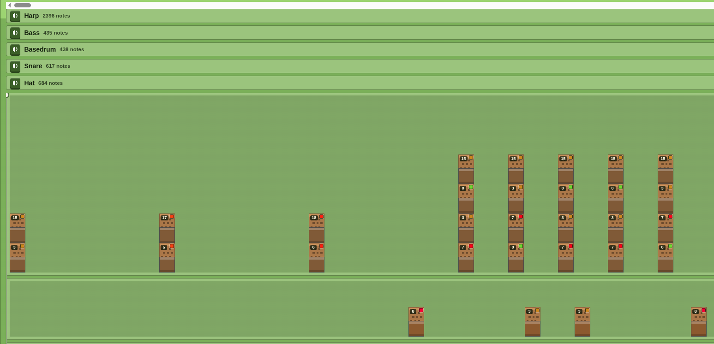
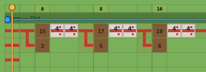
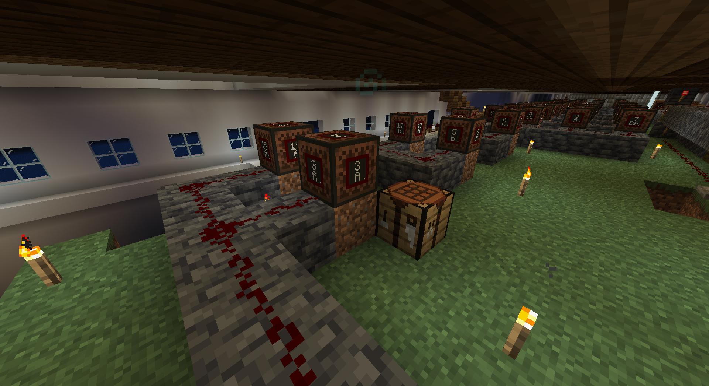
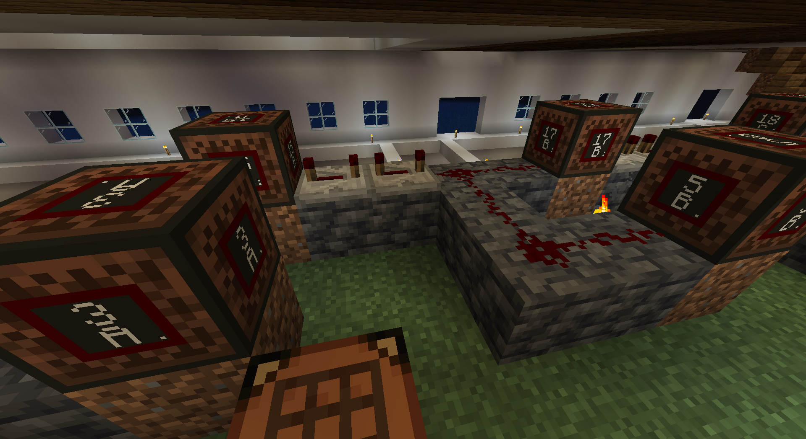

# MIDI to Minecraft Noteblocks

> Based on the original [midi-to-minecraft](https://github.com/colinthesealion/midi-to-minecraft/tree/master) by colinthesealion.

**Live app: [crare.github.io/midi-to-minecraft](https://crare.github.io/midi-to-minecraft)**

Convert `.midi` files into Minecraft note block build data and visualize, play back, and plan your build — all in the browser.

## What It Does

1. **Upload** any `.mid` / `.midi` file.
2. **Convert** — the app maps each MIDI instrument track to a Minecraft note block instrument and calculates the redstone tick delays between notes.
3. **Download** — get one JSON file per instrument lane, ready to use with a build script.
4. **Visualize** — see every lane as a horizontal timeline. Play it back in the browser with note block sounds, mute individual lanes, and scrub the playhead.
5. **Schematic** — a top-down grid shows every note block, repeater, and redstone dust placement. Includes block counts, raw resource totals, and minimum build dimensions.

## Screenshots

| Track Visualization | Build Schematic |
|---|---|
|  |  |

| In-game build (1) | In-game build (2) |
|---|---|
|  |  |

## Project Layout

- `midi-convert/` — TypeScript MIDI-to-JSON converter (CLI).
- `webapp/` — Static React app (Vite) for in-browser conversion, visualization, and schematic.

## Requirements

- Node.js >= 18

## Running Locally

```bash
cd webapp
yarn
yarn dev
```

Then open the local Vite URL shown in the terminal.

## Building for Production

```bash
cd webapp
yarn build
```

Static files are output to `webapp/dist/`. The site is automatically deployed to GitHub Pages on every push to `main`.

## CLI Converter (Optional)

```bash
cd midi-convert
yarn
yarn convert -i <input.mid> -o <output.json>
```

- Single-track MIDI → one file at the resolved output path.
- Multi-track MIDI → one file per track: `<name>.<track-index><ext>`.
- If `-o` has no directory, files are written to `midi-convert/output/`.
